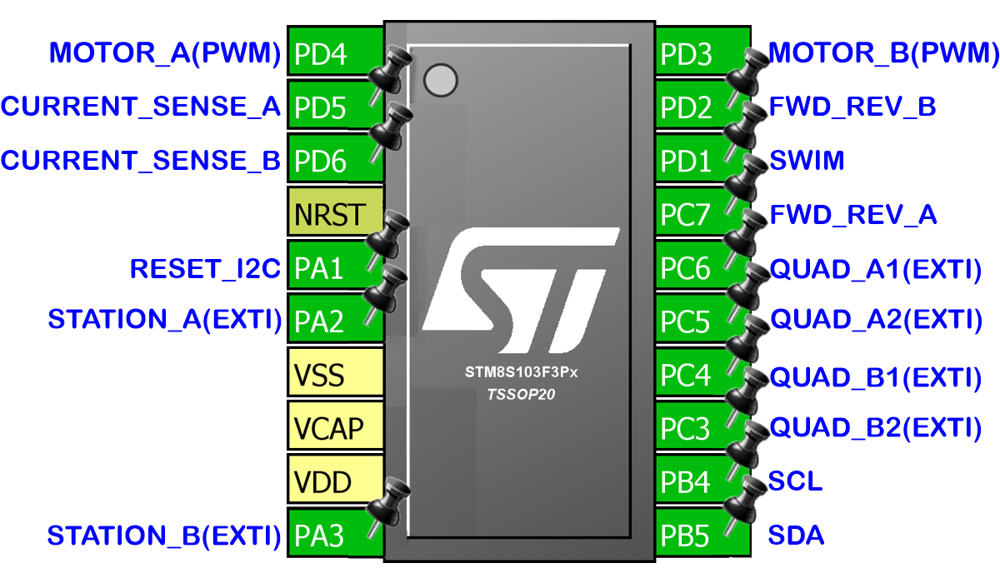
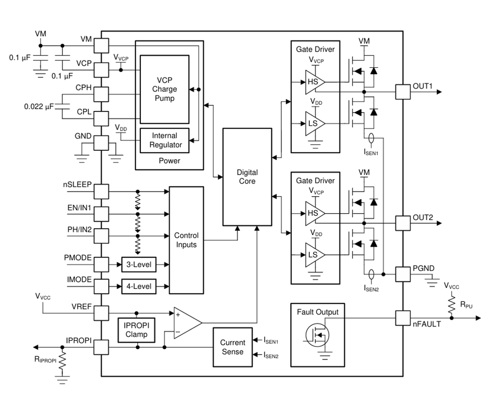

# This is My I2C Dual Motor Driver  
  
## This is an I2C controlled Dual Motor Driver Board.  
### Files are for [KiCAD EDA](https://www.kicad.org/)  
There is **"Tims_I2C_Dual_Motor_Driver.kicad_pcb.zip"** file  
* This can be used when **"Plot Files"** asked for at 
 
when ordering 10 PCBs for $5  
* If you have **[KiCAD EDA](https://www.kicad.org/)**,  

have a Plugin  that will make things simple to order a PCB,  
just load this project into **[KiCAD EDA](https://www.kicad.org/)** install the plugin click the Icon  and it will create all the nesesery files needed and take you to order a PCB 
and compeate the form on 
 
web site.  
  

## About  
The board can control two motors with quadratic encoders and a station to set a reference point.  
This is my second I2C Motor Driver, My first worked OK, but The MOSFETS I used where a little temperamental,  
so I decided to make a more robust version.  
This one I decided to control 2 motors from one microcontroller.  
* The main reason for having it control two motors at the same time was that I tried my original motor drivers controlling a tracked vehicle.  
It worked fine with two single motor drivers  but because I was using a web interface to control them there was a delay between turning on/off each motor.  
* I thought having a motor driver that controls two motor at the same time was a better approach.  
  
## The Motor Driver is controlled via the I2C bus.  
* Each board can have its own unique I2C Address.  
* Not using the reserved Addresses over 100 in theory can be attached to one I2C bus. (Addresses 10 to 127 probably) 7-bit Address.  
* The is a system to reset the I2C default address to 0x30.  
* There are two sockets for the I2C to that the boards can be daisy-chained, end to end.  
* There is place for pull-up resistors, depending on muti-board setup or single board setup, these can be enabled/disabled.  
  
  
## The Microcontroller is the STM8S103F3
  
* According to the Data Sheet, this can run with 2.95 to 5.5 V operating voltage.  
* Caution should be taken when programming, The ST-Link is 3.3v.  
* I was a little limited for pins and memory, as I am controlling two motors with this. The AI has been reduced, it still has inputs for quadratic encoders and a station, these enable it to know the rotation and position of the motors.  
* I was able to use the current sense from the DRV8876, so the load on the motors can be retrieved from communication via I2C.  
## There are LEDs for diagnostics.  
* Two Yellow LEDs, one for Motor Power and one for VCC.  
* There is a red LED on the SDA line to show activity.  
* For each motor there is a red LED to show a fault, a blue LED to show Motor on and a Green LED to show if motor forward or reverse (on/off).  
## There are Pads for programming the STM8S103F3
* To program the STM8S103F3 will require STMicroelectronics "ST Visual Programmer"  
* STMicroelectronics "ST Visual Programmer" is part of "ST MCU toolset".  
* I have done .s19 file for use with the "ST Visual Programmer".  
* An ST-Link is required.
  
## The Drivers used are DRV8876
  
The DRV8876 is an N-channel H-bridge motor driver, the board has two of these.  
* They have 4.5-V to 37-V operating supply voltage range.  
* 3.5-A Peak. On the board I have put places for Current limit resistors.  
* Supports 1.8-V, 3.3-V, and 5-V logic inputs. (The STM8S103F3 opperates at 2.95 to 5.5 V)  
* On the board the DRV8876 are set to PH/EN Control Mode.  
* The nSleep is fixed High, so no low power mode.  
* I have connected the IPROPI to the STM8S103F3 so current readings can be sensed.  
## There are connections for a Quadratic Encoder for each Motor  
  
The Quadratic Encoder needs to be the A/B type and be the same VCC as the Board.  
* If the Board counts bacwards when the motor runs forward, the two quadratic input need to be swapped.  
* With an encoder attached to a motor, commands can be sent to set the motor to a specific position.  
## There are connections for a Station for each Motor  
* A Station is a place for a switch to be fitted to a project, that when triggerd, will reset the position of the Motor to a known position.  
* There are two settings for the station depending on the direction of the Motor, most switches don't trigger at the same point when turning on and off.  
## Commands  
The Motor Driver Board is controlled by commands on the I2C Bus.  
* The Board can be connected to any microcontroller that has I2C.  
* All commands start with any byte, this is because I have an ESP8266 and they haven't fixed the first data byte issue. When sending data via the I2C on the ESP8266 the first byte gets 0x80 added to it. So my driver ignores the first byte sent. For simplicity I will use '#' as the first character of all commands sent to the Motor Driver.  
* The second byte is the Identifier that tells the driver the type of command. All commands are from the second byte onwards. I should say "char" as all commands are sent as ASCII characters.  
## Global Command 'M'  
* **M1** = Motor A is the current motor that will be adjusted.  
* **M2** = Motor B is the current motor that will be adjusted.  
* **M3** = Motor A and B be adjusted.  
* A global command can be used on its own (preceded with '#') or at the end of other commands (preceded with a space)  
## 'C' Commands (settings):
* **C1** = Sets the Current Position to 0 (zero). Just use **C1**.  
* **C6 B\<value>** = Set: Has a Station Position. **B**oolean = 1 or 0 (true or false).  
* **C7 P\<value>** = Set the Forward Station **P**osition value. value = a 16 bit value, Sets the Station Position while moving Forward.  
* **C8 P\<value>** = Set the Reverse Station **P**osition value. value = a 16 bit value, Sets the Station Position while moving in Reverse.  
* **C10 A\<value>** = Set I2C **A**ddress. value = 1 (0x00) to 127 (0x7F). This is to change the I2C Address of the device.  
* **C13 B\<value>** = Set I2C Speed. **B**oolean; Is it 400k. value = 1 or 0 (true or false). 1 = 400000, 0 = 100000.  
All setting are saved in non volatile memory.  
* No need to apply settings every time power it connected.  
## 'S' Command (Speed):
**S\<Value>** = Set the **S**peed 0 to 1000. This is a PWM value. So 500 would be 50% on 50% off square wave.  
## 'F' Commands (Forward):
* **F0** = Stop. Can just use 'F' as the buffer will be full of zeros.  
* **F1** = Forward at a current Speed.  
* **F1 S\<value>** = Forward at a set Speed.  
## 'R' Commands (Reverse):  
* **R0** = Stop. Can just use 'R' as the buffer will be full of zeros.  
* **R1** = Reverse at a current Speed.  
* **R1** S<value> = Reverse at a set Speed.  
## 'G' Commands (Go to):
* **G0** = **Stop**. Can just use **'G'** as the buffer will be full of zeros.  
* **G1 P\<value> S\<value>** = Move to an absolute **P**osition Forward (Positive) of zero at a **S**peed.  
* **G2 P\<value> S\<value>** = Move to an absolute **P**osition Reverse (Negative) of zero at a **S**peed.  
  
*Settings that set a position are only valid with motors that have a Quadratic Encoder.*  
  
The **'G'** code **P**\<value> can be negative values. So why have **G1** and **G2**?  
* To keep options open.  
* All positions are relative to a zero.  
* When writing your own code to control the Motors you may only have the option of Unsigned Integers.  
* You may want to only use Unsigned Integers to save memory.  

### *Click this image to see a video of it in use.*

## A Typical 4 Motor setup  
  
* One Microcontroller.  
* Two Driver Boards.  
* Four Motors With Quadratic Encoders.  
* Each Motor has a Station to set the the zero position.  
  

